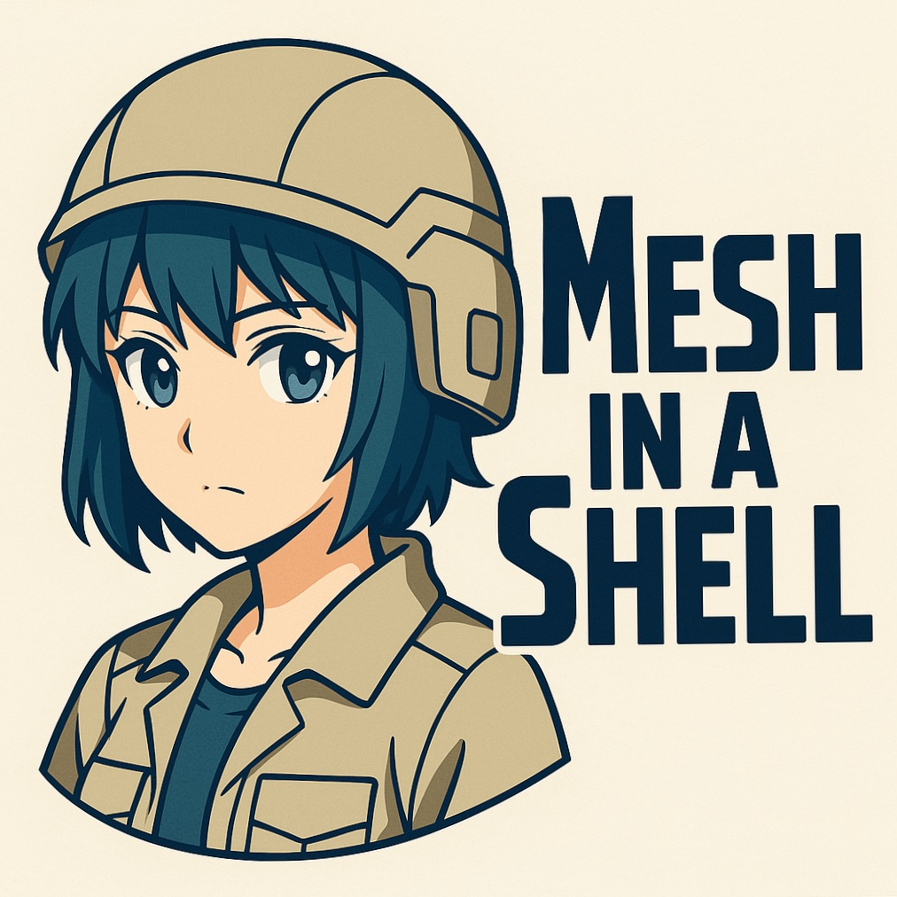

  

# Mesh in a Shell

## [Prologue](#Prologue)
The wind doesn't carry messages anymore.
Not in a world like this.

Now, voices ride invisible waves—low and long—passing through forests, through concrete, through time.
There’s no central server, no authority listening.
Just the Mesh.

It began as fragments—signal traces, whisper-nodes built by those who refused silence.
No one asked permission.
They built it anyway.
Small. Quiet. Persistent.

It doesn’t need speed.
It doesn’t need light.
Only intent.

A fingertip on cold glass.
A breath before a reply.
And a spark of voltage inside a humble shell.

Now the Mesh lives in the spaces between.
Not everywhere. But anywhere.
In any shell willing to carry it.
And once you’re part of it,
you’re never truly alone.

"And where does the newborn go from here?
The Net is vast and infinite."

---

**Mesh in a Shell** is a low-power, off-grid communication device designed to send and receive messages over LoRa mesh networks. It combines:

- An **ESP32-S3** as the always-on controller for power management, LoRa communication, and basic interaction
- An **Orange Pi Zero 2W** that wakes only when needed to run a local LLM or advanced interface
- A **2.9" touch e-paper display** for ultra-low power UI
- GPS for location tracking (with periodic pings)
- Physical buttons for fast replies or triggering full mode

---

## [Features](#features)

- Ultra-low power idle mode with ESP32 handling core functions
- On-demand activation of a local AI core for complex responses
- Mesh messaging over LoRa
- GPS-based location sharing
- Simple UI and a fun wire-connecting mini-game during boot

---

## [Usage Scenarios](#usage-scenarios)

- Off-grid messaging with location awareness
- Emergency comms with smart predicted replies
- Quiet mesh communication in remote areas

---

## [Project Structure](#project-structure)

- [`/docs/`](docs/) – All design documentation
- [`/firmware/esp32s3/`](firmware/esp32s3/) – Code for ESP32-S3 (power mgmt, LoRa, GPS, mini-game)
- [`/firmware/orangepi/`](firmware/orangepi/) – Code for Orange Pi (LLM, full UI)
- [`/images/`](images/) – Diagrams and mockups
- [`/assets/`](assets/) – Logos and visual assets

---

## [License](#license)

unknown yet

---

## [Scope](docs/scope.md)

Detailed overview of what Mesh in a Shell is designed to accomplish.
